# 🎯 Website Design Scorer - Automated Analysis System

## 📋 Project Overview

**Automated website design analysis system** that combines AI vision analysis with rule-based scoring to provide comprehensive website design evaluations. The system captures screenshots, analyzes design quality across 5 categories, stores results in the cloud, and logs everything to Google Sheets for tracking.

---

## 🔄 Automated Implementation Flow

```mermaid
graph TD
    A[🌐 Website URL Input] --> B[📸 Multi-Device Screenshots]
    B --> C[🧠 AI Vision Analysis]
    B --> D[📏 Rule-Based Analysis]
    C --> E[💾 Cloud Storage Upload]
    D --> E
    E --> F[📊 Google Sheets Logging]
    F --> G[📈 Complete Analysis Report]
    
    subgraph "Parallel Execution"
        B1[Desktop: 1200x800]
        B2[Mobile: 375x667]
    end
    
    subgraph "AI Analysis Engine"
        C1[Ollama Qwen2.5VL Model]
        C2[Screenshot Visual Analysis]
        C3[Design Insights Generation]
    end
    
    subgraph "Rule Engine"
        D1[Typography Scoring]
        D2[Color Harmony Check]
        D3[Layout Assessment]
        D4[Responsiveness Test]
        D5[Accessibility Audit]
    end
```



---

## 🏗️ Technical Architecture

### 🚀 Core Services

| Service | Technology | Purpose | Status |
|---------|------------|---------|---------|
| **Backend API** | FastAPI + Python | Master orchestrator & API endpoints | ✅ Running |
| **AI Engine** | Ollama + Qwen2.5VL | Vision-based design analysis | ✅ Running |
| **Screenshot Service** | Playwright | Multi-device webpage capture | ✅ Active |
| **Cloud Storage** | Cloudinary | Image hosting with optimization | ✅ Active |
| **Data Logging** | Google Sheets API | Analysis results tracking | ✅ Active |

### 🔧 Infrastructure

- **Containerization**: Docker Compose with service orchestration
- **AI Model**: Qwen2.5VL (7B parameter vision-language model)
- **Image Processing**: WebP optimization, thumbnail generation
- **Database**: Google Sheets (analysis history & reporting)

---

## 🎯 Primary API Endpoint

### **Single-Call Complete Analysis**

```bash
POST /api/v1/master/analyze-complete
```

**One endpoint does everything:**
- ✅ Captures desktop + mobile screenshots
- ✅ Runs AI vision analysis (always enabled)
- ✅ Performs rule-based scoring
- ✅ Uploads to Cloudinary with optimization (always enabled)
- ✅ Logs results to Google Sheets
- ✅ Returns complete analysis data

### Example Usage

```bash
# Simple request - AI analysis and cloud storage always enabled
curl -X POST "http://localhost:8000/api/v1/master/analyze-complete" \
  -H "Content-Type: application/json" \
  -d '{
    "url": "https://stripe.com",
    "auto_log_to_sheets": true,
    "include_mobile": true
  }' | jq .
```

### Response Structure

```json
{
  "analysis_id": "master_1722692431",
  "url": "https://stripe.com",
  "status": "completed",
  "completed_at": "2025-08-03T11:40:31.456789",
  "analysis_duration": 12.45,
  "overall_score": 67.2,
  "scores_breakdown": {
    "typography": 72.0,
    "color": 68.0,
    "layout": 75.0,
    "responsiveness": 65.0,
    "accessibility": 56.0
  },
  "screenshots": [
    {
      "device": "desktop",
      "cloudinary_url": "https://res.cloudinary.com/...",
      "captured_at": "2025-08-03T11:40:19.123456"
    },
    {
      "device": "mobile", 
      "cloudinary_url": "https://res.cloudinary.com/...",
      "captured_at": "2025-08-03T11:40:20.654321"
    }
  ],
  "ai_insights": {
    "llm_analysis": {
      "design_observations": "Clean, professional layout with strong visual hierarchy...",
      "strengths": ["Clear navigation", "Consistent branding", "Good color contrast"],
      "improvement_suggestions": ["Increase mobile touch targets", "Add more whitespace"]
    }
  },
  "uploads": {
    "desktop_url": "https://res.cloudinary.com/...",
    "desktop_thumbnail": "https://res.cloudinary.com/.../w_200,h_150",
    "mobile_url": "https://res.cloudinary.com/...",
    "mobile_thumbnail": "https://res.cloudinary.com/.../w_150,h_200"
  }
}
```

---

## 📊 Analysis Engine Details

### 🧠 AI Vision Analysis (Qwen2.5VL Model)

**What it analyzes:**
- Visual design patterns and composition
- Color harmony and brand consistency  
- Typography readability and hierarchy
- Layout balance and whitespace usage
- Mobile responsiveness indicators

**Process:**
1. Receives high-quality screenshots (desktop + mobile)
2. Uses specialized design analysis prompts
3. Provides detailed observations and recommendations
4. Generates improvement suggestions

### 📏 Rule-Based Scoring System

**5-Category Analysis (0-100 points each):**

| Category | Metrics Analyzed | Weight |
|----------|------------------|---------|
| **Typography** | Font size ≥16px, line-height 1.4-1.6, contrast ratios, hierarchy | 20% |
| **Color** | Harmony checks, saturation limits, contrast ratios, consistency | 20% |
| **Layout** | 8px grid alignment, whitespace ratio 30-50%, visual balance | 20% |
| **Responsiveness** | Viewport meta, breakpoints, touch targets ≥44px | 20% |
| **Accessibility** | Alt text, ARIA labels, semantic HTML, focus order | 20% |

**Grade Scale:**
- A: 90-100 (Excellent)
- B: 80-89 (Good) 
- C: 70-79 (Fair)
- D: 60-69 (Poor)
- F: 0-59 (Failing)

---

## 📈 Real-World Test Results

### Recent Analysis Examples:

| Website | Overall Score | Grade | Top Issues |
|---------|---------------|-------|------------|
| **Apple.com** | 93.5/100 | A | Minor accessibility improvements |
| **Stripe.com** | 67.2/100 | D | Touch targets, whitespace optimization |
| **Amazon.com** | 59.5/100 | F | Typography hierarchy, color contrast |

---

## 🚀 Quick Start Guide

### 1. Start the System
```bash
cd backend/
docker compose up -d
```

### 2. Verify Services
```bash
curl http://localhost:8000/api/v1/master/health
```

### 3. Run Analysis
```bash
curl -X POST "http://localhost:8000/api/v1/master/analyze-complete" \
  -H "Content-Type: application/json" \
  -d '{"url": "https://github.com"}' | jq .
```

### 4. View Results
- API response contains complete analysis
- Images stored in Cloudinary with CDN URLs
- Results logged to Google Sheets for tracking

---

## 🔧 Development Environment

### Prerequisites
- Docker & Docker Compose
- Python 3.11+ (for local development)
- Cloudinary account (image storage)
- Google Cloud Service Account (Sheets API)

### Local Setup
```bash
# Clone and navigate
cd backend/

# Configure environment
cp .env.sample .env
# Edit .env with your API keys

# Install dependencies (optional - Docker handles this)
uv pip install -e .

# Start services
docker compose up -d

# Test endpoints
curl http://localhost:8000/docs  # Interactive API docs
```

---

## 📁 Project Structure

```
test-one/
├── backend/                     # Main application
│   ├── src/app/
│   │   ├── api/                # API endpoints
│   │   │   ├── master_analysis.py  # 🎯 Primary endpoint
│   │   │   └── health.py           # Health checks
│   │   └── services/           # Core business logic
│   │       ├── ai_analysis.py      # AI vision analysis
│   │       ├── screenshot.py       # Playwright capture
│   │       ├── cloudinary.py       # Image storage
│   │       └── google_sheets.py    # Data logging
│   ├── credentials/            # API keys (gitignored)
│   ├── cache/                  # Temp screenshots (gitignored)
│   ├── docker-compose.yml     # Service orchestration
│   ├── Dockerfile             # Backend container
│   ├── requirements.txt       # Python dependencies
│   └── rules.md               # Scoring rules specification
├── frontend/                  # Next.js UI (future)
└── README.md                  # Documentation
```

---

## 🔒 Security & Configuration

### Protected Files (Gitignored)
- `backend/credentials/` - API keys and service accounts
- `backend/cache/` - Temporary screenshot files
- `*.json` credentials files (Google Cloud, Cloudinary)

### Environment Variables
```bash
# AI Model
OLLAMA_BASE_URL=http://localhost:11434
OLLAMA_MODEL=qwen2.5vl:latest

# Image Storage
CLOUDINARY_CLOUD_NAME=your_cloud_name
CLOUDINARY_API_KEY=your_api_key
CLOUDINARY_API_SECRET=your_api_secret

# Google Sheets (service account JSON file)
GOOGLE_APPLICATION_CREDENTIALS=./credentials/google-sheets-service-account.json
```

---

## 📊 Current System Status

### ✅ Completed Features
- [x] Multi-device screenshot capture (desktop + mobile)
- [x] AI vision analysis with Qwen2.5VL model
- [x] Rule-based scoring across 5 categories
- [x] Cloudinary integration with image optimization
- [x] Google Sheets automated logging
- [x] Master orchestrator API endpoint
- [x] Docker containerization with health checks
- [x] Comprehensive error handling and logging
- [x] Security hardening (credential protection)

### 🔄 Active Services
- **Backend API**: http://localhost:8000 (FastAPI)
- **AI Model**: http://localhost:11434 (Ollama + Qwen2.5VL)
- **Interactive Docs**: http://localhost:8000/docs

### 📈 Performance Metrics
- **Analysis Time**: ~10-15 seconds per website
- **Screenshot Quality**: 1200x800 (desktop), 375x667 (mobile)
- **AI Model**: 7B parameter vision-language model
- **Storage**: WebP optimization with thumbnail generation
- **Logging**: Real-time Google Sheets integration

---

## 🎯 Usage Examples

### Basic Website Analysis
```bash
# Analyze any website - AI analysis and cloud storage always enabled
curl -X POST "http://localhost:8000/api/v1/master/analyze-complete" \
  -H "Content-Type: application/json" \
  -d '{"url": "https://example.com"}'
```

### Configuration Options
```bash
# Available configuration options
curl -X POST "http://localhost:8000/api/v1/master/analyze-complete" \
  -H "Content-Type: application/json" \
  -d '{
    "url": "https://example.com",
    "auto_log_to_sheets": false,     # Skip Google Sheets logging
    "include_mobile": false          # Desktop screenshots only
  }'
```

### Health Check
```bash
# Verify all services
curl http://localhost:8000/api/v1/master/health
```

---

## 🚀 Next Steps

### Potential Enhancements
1. **Frontend Dashboard** - React/Next.js interface for easy analysis
2. **Batch Processing** - Analyze multiple URLs simultaneously
3. **Performance Metrics** - Page speed and Core Web Vitals
4. **Historical Tracking** - Score trends over time
5. **Custom Rules** - User-defined scoring criteria
6. **API Authentication** - Secure access controls
7. **Webhook Integration** - Real-time notifications

### Production Readiness
- Load balancing for high-traffic scenarios
- Database optimization for large datasets
- Monitoring and alerting setup
- API rate limiting and caching
- Automated testing suite

---

*This automated website design analysis system provides comprehensive, objective scoring with AI-powered insights, making web design evaluation scalable and consistent.*
